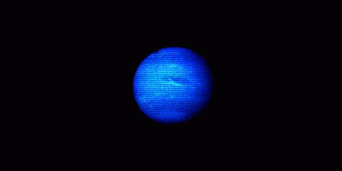

  

<h1 align="center">Hi, I'm NXPTUNX 🏁</h1>

  <em>“It’s not always about speed. It’s about control.” – MF GHOST</em>
  <em>“On the edge of control, the mind leaves the body… and what drives isn't the driver anymore.” – nxptunx</em>

---

### 🛠️ About Me
Developer,what did u even expect?
Makes music when free time

---

### 📬 Contact Me

---

### 🧰 Tech Stack

---

### 📊 GitHub Stats

  
  

---

### 🏎️ Fun Badges

---
